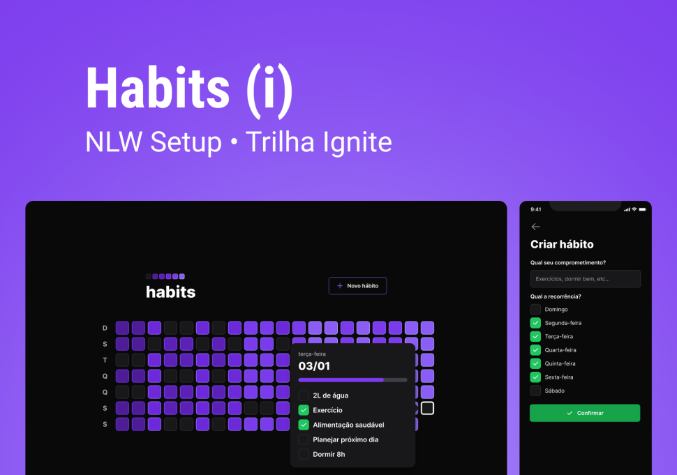

<a name="readme-top"></a>

<!-- PROJECT LOGO -->
<div align="center">
  <h3 align="center">NLW SETUP - Ignite - Habits (i)</h3>

  <a href="https://github.com/othneildrew/Best-README-Template">
    
  </a>

  <p align="center">
    <b>Track habits with this full stack web and mobile application</b>
    <br />
    <a href="https://github.com/othneildrew/Best-README-Template">View Demo</a>
    ·
    <a href="https://github.com/AlexandreFPGoncalves/nlw-setup-habits/issues">Report Bug</a>
    ·
    <a href="https://github.com/AlexandreFPGoncalves/nlw-setup-habits/issues">Request Feature</a>
  </p>
</div>

<!-- ABOUT THE PROJECT -->

## About The Project

This project idea as well as it's design was provided by [@RocketSeat](https://github.com/Rocketseat). It's a limited time free project from their Ignite Trail.

<b>Main features:</b>

-
-
-

<b>Working Devices:</b>

-   Desktop
-   Mobile (Android or IOS)

### Built With

This section should list any major frameworks/libraries used to bootstrap your project. Leave any add-ons/plugins for the acknowledgements section. Here are a few examples.

[![Next][next.js]][next-url] [![React][react.js]][react-url] [![Vue][vue.js]][vue-url] [![Angular][angular.io]][angular-url] [![Svelte][svelte.dev]][svelte-url] [![Laravel][laravel.com]][laravel-url] [![Bootstrap][bootstrap.com]][bootstrap-url] [![JQuery][jquery.com]][jquery-url]

<!-- GETTING STARTED -->

## Getting Started

This is an example of how you may give instructions on setting up your project locally.
To get a local copy up and running follow these simple example steps.

### Prerequisites

-   For <b>Node</b> Either install version 18.13.0 (current LTS) or use [Node Version Manager](https://www.freecodecamp.org/news/nvm-for-windows-how-to-download-and-install-node-version-manager-in-windows-10/#howtodownloadandinstallnodeversionmanagerinwindows10).

    ```powershell
    nvm install 18.13.0
    nvm use 18.13.0
    ```

-   Install the latest version of <b>npm</b>.
    ```sh
    npm install npm@latest -g
    ```

### Installation (not Finished)

_Below is an example of how you can instruct your audience on installing and setting up your app. This template doesn't rely on any external dependencies or services._

1. Get a free API Key at [https://example.com](https://example.com)
2. Clone the repo
    ```sh
    git clone https://github.com/your_username_/Project-Name.git
    ```
3. Install NPM packages
    ```sh
    npm install
    ```
4. Enter your API in `config.js`
    ```js
    const API_KEY = 'ENTER YOUR API';
    ```

<p align="right">(<a href="#readme-top">back to top</a>)</p>

<!-- ROADMAP -->

## Roadmap

-   [x] Initial Backend Structure
-   [x] Initial Web Frontend Structure
-   [ ] Initial Mobile Frontend Structure

<!-- Initial Backend Configuration -->

## Initial Backend Configuration:

1.  Start creating the <b>root project folder</b> and inside it a <b>./server folder</b>.
2.  Inside <b>./server</b>, initialize the project by running the command <b>`npm init -y`</b>. This line will create the <b>./server/package.json</b> file.
3.  Install the package [Fastify](https://www.npmjs.com/package/fastify) with the command <b>`npm i fastify`</b>.
4.  Create the following folder and file <b>`./server/src/server.ts`</b>.

5.  Install [Typescript](https://www.npmjs.com/package/typescript) as a dev dependency with <b>`npm i -D typescript`</b>.
6.  Create the <b>./server/tsconfig.json</b> file by running <b>`npx tsc --init`</b>.
7.  Install [Tsx](https://www.npmjs.com/package/tsx) as a dev dependency by running <b>`npm i tsx -D`</b>.
8.  Inside the file <b>./server/package.json</b> create a script to start the server.

```json
//The keyword watch inside the script will re-run the script every time the file is changed.
  "scripts": {
    "dev": "tsx watch src/server.ts"
  },
```

9.  inside <b>./server/src/server.ts</b> create the servers initial structure using [Fastify](https://www.npmjs.com/package/fastify), it is similar to express.

```ts
//Back-end API RESTful
import Fastify from 'fastify';

const app = Fastify();

// HTTP Methods: Get, Post, Put, Patch, Delete
app.get('/', () => {
	return 'Hello World';
});

app.listen({
	port: 8888,
});
```

10. Installing [Prisma](https://www.prisma.io) as a dev dependency with the command <b>`npm i -D prisma`</b>.
11. Install the [@Prisma/client](https://www.prisma.io/docs/concepts/components/prisma-client) with the command <b>`npm i @prisma/client`</b>.
12. Run the following command <b>`npx prisma init --datasource-provider SQLite`</b>, this will make so our database will be from the type SQLite, which will create a local database file.
13. Make sure you have setup [Prisma's Extension](https://marketplace.visualstudio.com/items?itemName=Prisma.prisma), Inside <b>./server/prisma/schema.prisma</b> create a model, which is a general name for tables or collections.

```ts
model Habit {
  //this line of code says that my table has an ID which is the primary key of the db and will also initialize it with an unique id.
    id         String @id @default(uuid())
    Title      String
    created_at DateTime

    @@map("habits")
}
```

14. Once the structure is created run the command <b>`npx prisma migrate dev`</b> which will read the schema file and see any changes and automatically create a sql file that will change the database, <b>these files are called migrations</b>.
15. By running the command <b>`npx prisma studio`</b> we can visualize and create entries on the database.
16. Back to our <b>./server/src/server.ts</b> we can now access our database and created tables.

```ts
import { PrismaClient } from '@prisma/client';
const prisma = new PrismaClient();

app.get('/', async () => {
	const habits = await prisma.habit.findMany();
	return habits;
});
//output: [{"id":"797b51f4-b215-40e3-9f52-93a39b680960","title":"Drink 3L of Water","created_at":"2023-01-18T00:00:00.000Z"}]
```

17. Configuration of CORS by installing the @fastify/cors package and back on the server/server.js we have to register our cors.

18. Install the [@Fastify/cors](https://github.com/fastify/fastify-cors) package with <b>`npm i @fastify/cors`</b>.
19. Inside <b>./server/src/server.ts</b> register the cors.

```ts
import cors from '@fastify/cors';
app.register(cors);
```

<!-- Initial Web Frontend Configuration -->

## Initial Web Frontend Configuration:

1.  Run the command <b>`npm create vite@latest`</b>, let it install any dependencies, name your project <b>"web"</b> and select [Typescript](https://www.npmjs.com/package/typescript).
2.  Navigate inside <b>./web</b> and install the dependencies with the <b>`npm i`</b> command.
3.  Now for the Styling Library, we are going to be using [Tailwindcss](https://tailwindcss.com), install along with [Postcss](https://postcss.org) and [autoprefixer](https://autoprefixer.github.io) as dev dependencies with the command <b>`npm i -D tailwindcss postcss autoprefixer`</b>.

4.  To create [Tailwindcss](https://tailwindcss.com) and [Postcss](https://postcss.org) configuration file run <b>`npx tailwindcss init -p`</b>.
5.  Create <b>./web/src/styles/global.css</b> and while having the postcss and tailwindcss extension installed add the following lines to the file.

```ts
@tailwind base;
@tailwind utilities;
@tailwind components;
```

6.  Inside <b>./web/tailwind.config.cjs</b> configure it so that our files have permission to read tailwind styles.

```ts
module.exports = { content: ['./src/**/*.tsx', '.index.html'] };
```

<!-- Initial Mobile Configuration -->

## Initial Mobile Configuration

1.  Setup the development environment following this [Guide](https://react-native.rocketseat.dev).
2.  Run the command <b>`npx create-expo-app mobile --template`, don't forget the <b>--template</b> keyword and to select the <b>Blank (TypeScript)</b> option </b> to create the <b>./mobile</b> folder.
3.  Run the command <b>`npx expo start`</b> to start your development server and either scan the QRcode or use the metro IP. Passing the <b>--clear</b> flag will create a new bundle from scratch.
4.  Import already own or create the assets by using the [Expo App Icon & Splash](https://www.figma.com/community/file/1155362909441341285).
5.  Inside <b>./mobile/app.json</b> change the splash and android objects background color to match the asset you just imported.
6.  Install a [Custom Font](https://docs.expo.dev/guides/using-custom-fonts/), and inside <b>./mobile/App.tsx</b> import the fonts.

```ts
import {
	useFonts,
	Inter_400Regular,
	Inter_600SemiBold,
	Inter_700Bold,
	Inter_800ExtraBold,
} from '@expo-google-fonts/inter';

//fontsLoaded will wait for the fonts to load before rending the app.
const [fontsLoaded] = useFonts({ Inter_400Regular, Inter_600SemiBold, Inter_700Bold, Inter_800ExtraBold });
if (!fontsLoaded) {
	return <Loading />;
}
```

<!-- Knowledge -->

## Knowledge (not Finished)

Node

Node allows us to use Javascript to create backend operations.
Node is nothing less than the V8 engine from Google Chrome, running outside of Google Chrome.

Tsx

The [tsx package](https://www.npmjs.com/package/tsx) allows us to read Typescript code without any file conversion, it is advised to create a script on the /package.json file to run the tsx .. command.

[Http Methods]()

Get, Post, Put, Patch, Delete

[Prisma and ORM](https://www.prisma.io)

by running npx prisma studio an interface with our db will be displayed.

[Vite](https://vitejs.dev)

[tailwindcss]()

[postcss]()

[autoprefixer]()

[React Native]()

[Expo](https://docs.expo.dev)
Build one JavaScript/TypeScript project that runs natively on all your users' devices.

<p align="right">(<a href="#readme-top">back to top</a>)</p>

<!-- Used Packages and Libraries -->

## Used Packages and Libraries (Not Finished)

[fastify](https://www.npmjs.com/package/fastify) - An efficient server implies a lower cost of the infrastructure, a better responsiveness under load and happy users. How can you efficiently handle the resources of your server, knowing that you are serving the highest number of requests as possible, without sacrificing security validations and handy development?

[typescript](https://www.npmjs.com/package/typescript)
[tsx](https://www.npmjs.com/package/tsx)

<p align="right">(<a href="#readme-top">back to top</a>)</p>

<!-- LICENSE -->

## License

Distributed under the MIT License. See `LICENSE.txt` for more information.

<!-- CONTACT -->

## Contact

Alexandre Gonçalves - [@VioletAlex\_](https://twitter.com/VioletAlex_) - alexandrefpgoncalves@gmail.com

Project Link: [nlw-setup-habits](https://github.com/AlexandreFPGoncalves?tab=repositories)

<!-- ACKNOWLEDGMENTS -->

## Acknowledgments

> Thanks to [@RocketSeat](https://www.youtube.com/@rocketseat) for providing the community with such challenge.

<!-- MARKDOWN LINKS & IMAGES -->
<!-- https://www.markdownguide.org/basic-syntax/#reference-style-links -->

[contributors-shield]: https://img.shields.io/github/contributors/othneildrew/Best-README-Template.svg?style=for-the-badge
[contributors-url]: https://github.com/othneildrew/Best-README-Template/graphs/contributors
[forks-shield]: https://img.shields.io/github/forks/othneildrew/Best-README-Template.svg?style=for-the-badge
[forks-url]: https://github.com/othneildrew/Best-README-Template/network/members
[stars-shield]: https://img.shields.io/github/stars/othneildrew/Best-README-Template.svg?style=for-the-badge
[stars-url]: https://github.com/othneildrew/Best-README-Template/stargazers
[issues-shield]: https://img.shields.io/github/issues/othneildrew/Best-README-Template.svg?style=for-the-badge
[issues-url]: https://github.com/othneildrew/Best-README-Template/issues
[license-shield]: https://img.shields.io/github/license/othneildrew/Best-README-Template.svg?style=for-the-badge
[license-url]: https://github.com/othneildrew/Best-README-Template/blob/master/LICENSE.txt
[linkedin-shield]: https://img.shields.io/badge/-LinkedIn-black.svg?style=for-the-badge&logo=linkedin&colorB=555
[linkedin-url]: https://linkedin.com/in/othneildrew
[product-screenshot]: images/screenshot.png
[next.js]: https://img.shields.io/badge/next.js-000000?style=for-the-badge&logo=nextdotjs&logoColor=white
[next-url]: https://nextjs.org/
[react.js]: https://img.shields.io/badge/React-20232A?style=for-the-badge&logo=react&logoColor=61DAFB
[react-url]: https://reactjs.org/
[vue.js]: https://img.shields.io/badge/Vue.js-35495E?style=for-the-badge&logo=vuedotjs&logoColor=4FC08D
[vue-url]: https://vuejs.org/
[angular.io]: https://img.shields.io/badge/Angular-DD0031?style=for-the-badge&logo=angular&logoColor=white
[angular-url]: https://angular.io/
[svelte.dev]: https://img.shields.io/badge/Svelte-4A4A55?style=for-the-badge&logo=svelte&logoColor=FF3E00
[svelte-url]: https://svelte.dev/
[laravel.com]: https://img.shields.io/badge/Laravel-FF2D20?style=for-the-badge&logo=laravel&logoColor=white
[laravel-url]: https://laravel.com
[bootstrap.com]: https://img.shields.io/badge/Bootstrap-563D7C?style=for-the-badge&logo=bootstrap&logoColor=white
[bootstrap-url]: https://getbootstrap.com
[jquery.com]: https://img.shields.io/badge/jQuery-0769AD?style=for-the-badge&logo=jquery&logoColor=white
[jquery-url]: https://jquery.com
